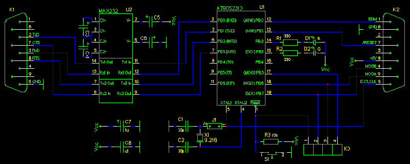
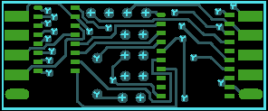
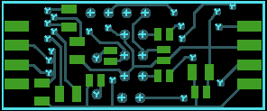
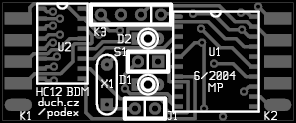
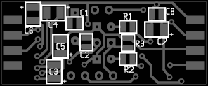
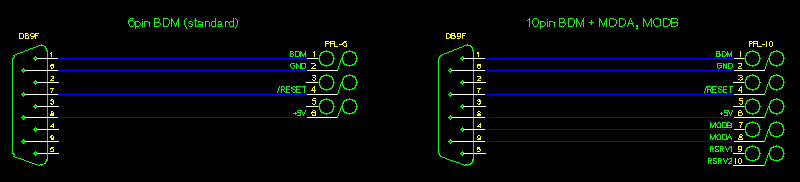
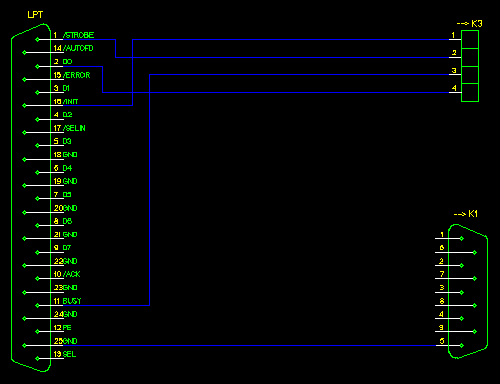

# Hardware

## Schematics

To connect a wire on one side and RS232 on the other to the MCU is almost as difficult as to connect a bulb to battery in a torch.



RS232 signals TxD, RxD, RTS, CTS (in schematics marked from podex' point of view) are connected to AVR MCU via buffer U2, MAX232. In prototype, there has been used "worse" variant MAX232 (no A suffix), which may require 1uF capacitors around it (on PCB the size 1206 was chosen). They can be tantalum, but they are also available in ceramic with this capacity (wow, that progress... on Taiwan they are really working hard). Connector K1 can be plugged directly to the COM-port of IBM PC. LEDs D1, D2 acts as indicators of activity and error state and also can be controlled by software of control computer. There are signals MOSI, MISO and SCK of serial programming interface of AVR and its /RESET signal available on connector K3, which serve (together with GND potential from K1 or K2) as an interface for programming FLASH of AVR by podex firmware. PCB allows connecting a switch S1 for resetting AVR, but this shouldn't be needed. Clock for AVR is obtained from crystal X1 with the most desirable frequency of 9.216MHz -- maximal supported rate for 5V AT90S2313 is 10MHz and 9.216MHz is the nearest lower rate, which allows precise division to 115200b/s serial transfer. Crystal is connected through point J1, which should be disconnected and then get clock from external source via connector K2, for example from EClock signal of HC12 CPU. Connector K2 is to be connected to BDM, and among this external clock contains three-state signal BDM(BKGD), signal /RESET and software controlled lines MODA, MODB, allowing use of extended memory (bus) of HC12 CPU.


## Construction

Podex has been designed on two-sided PCB with SMD components mounted on both sides. The most narrow distance between conductors is ca. 0.2mm, but some very kind people at [one PCB laboratory](www.fm.tul.cz/en/departmens/institute-of-information-technology-and-electronics/structure/pcb-lab), which officialy supports only spaces greater than 0.25mm, made boards of podex in a perfect quality. Board has to be put to a cover of two connectors Canon DB9. It is placed between pins of these connectors and surface soldered to these pins (which are ordinary used for soldering with cable wires). Connectors are used this way to hold a board in position. Connector K1 is female, according to RS232 connection, K2 is male to avoid their swapping. LEDs are round with 3mm diameter, if they will be used, it would be very nice to drill holes for them in a cover. As a programming connector K3 I have used SIL (single-in-line) sockets, available as a line, which can be broken to smaller pieces. Pay attention for this component not to be too much thick to fit in a cover. J1 can be hardly connected by a wire, if you won't use external clock (otherwise, let it disconnected). You will probably never need a S1 switch. If you can't use PCB of this layout or you can't order fabrication of it, you can build the circuit on a universal PCB -- it is very simple.

### Printed Circuit Board

#### PCB (Top Layer)



#### PCB (Bottom Layer)



#### Components (Top Layer)



#### Components (Bottom Layer)



### List of Components

| Parts              | Description          | Package | Value    |
|--------------------|----------------------|---------|----------|
| U1                 | AT90S2313            | SO20W   |          |
| U2                 | MAX232               | SO16    |          |
| K1, K2             | DB9                  | DB9SM   |          |
| D1                 | LED                  | LED_3mm | R        |
| D2                 | LED                  | LED_3mm | G        |
| C1, C2             | CAPACITOR            | 0805    | 33p      |
| C8                 | CAPACITOR            | 0805    | u1       |
| R1, R2             | RESISTOR             | 0805    | 330      |
| R3                 | RESISTOR             | 805     | 10k      |
| S1                 | SWITCH_PUSHBUTTON_NO | JUMPER2 |          |
| X1                 | CRYSTAL              | HC49    | 9.216MHz |
| J1                 | JUMPER               | JUMPER2 |          |
| C3, C4, C5, C6, C7 | CAPACITOR            | 1206    | 1u       |
| K3                 | HEADER3              | JUMPER4 |          |

Podex box is connected to control computer by direct plugging it to RS232 DB9 connector or by a cable, which must contain signals RTS and CTS. For BDM interface, there is a standardized 6pin connector, recommended by HC12 documentation, for use of lines MODA, MODB there is its 10pin extension. Pinout of K2 connector is chosen to allow direct interconnection of self-cutting DB9 connector on the podex side and 6(10)pin self-cutting connector PFL on the other side of AWG cable.




## Firmware Flashing

Firmware is loaded to FLASH of AVR AT90S2313 via connector K3. For this it is sufficient to connect serial programming interface signals to parallel interface LPT/Centronics according to following schematic, widely used in AVR community and known as a "Direct AVR Parallel Access":



Attention, there should be also connected a ground of podex (GND) to a control computer during programing, using a connector K1. Also it is needed to power flashed podex by 5V source via K2 connector (it is possible to power it from a HC12 board, if there aren't used lines MODA, MODB).

With above mentioned parallel port connection there can be used e.g. flashing software [uisp](http://www.nongnu.org/uisp/). The firmware is then loaded e.g. by the following command:

```bash
uisp -dlpt=0x378 -dprog=dapa --erase --upload --verify if=podex.hex -v=3 --hash=12
```

(0x378 is LPT base address, podex.hex is filename of the firmware, for more see uisp docs.) After loading of firmware the podex is finished and ready to operate with HC12.
